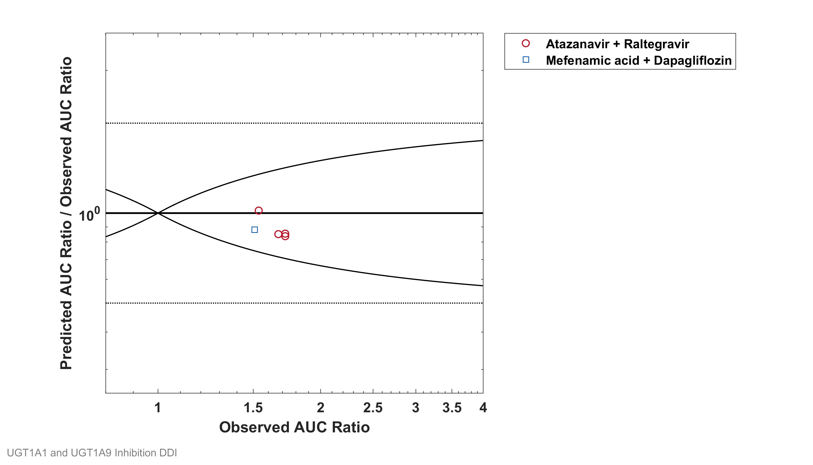
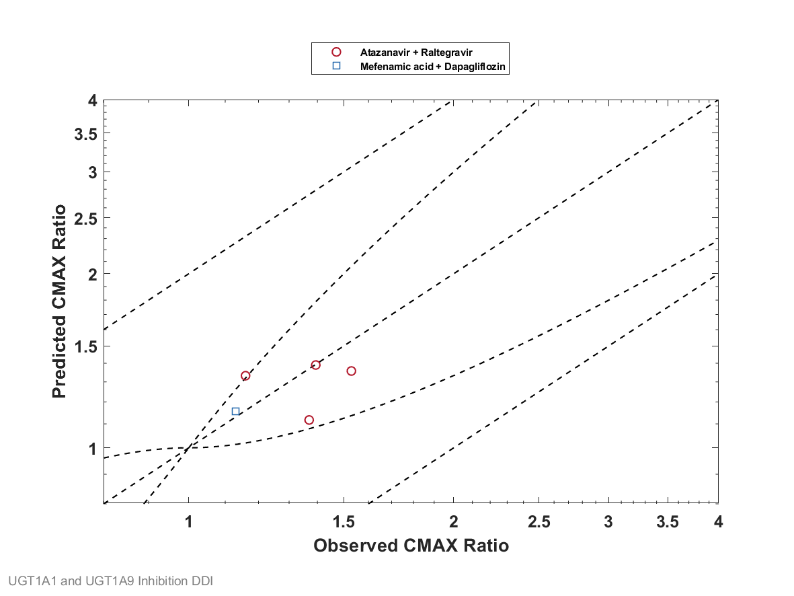
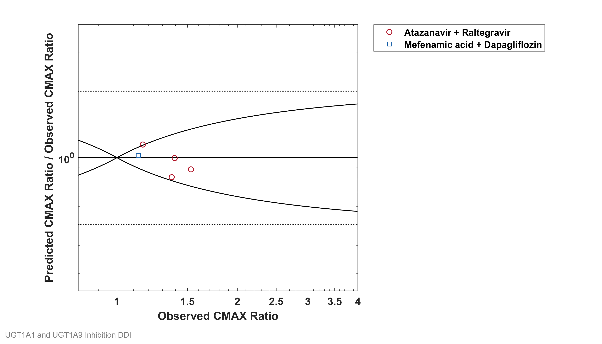
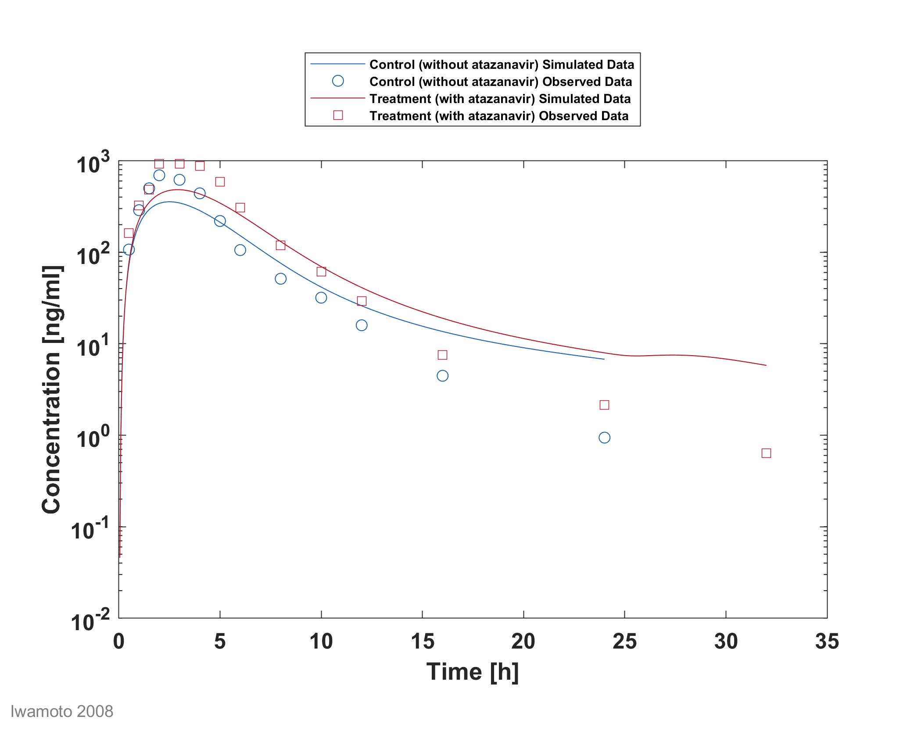
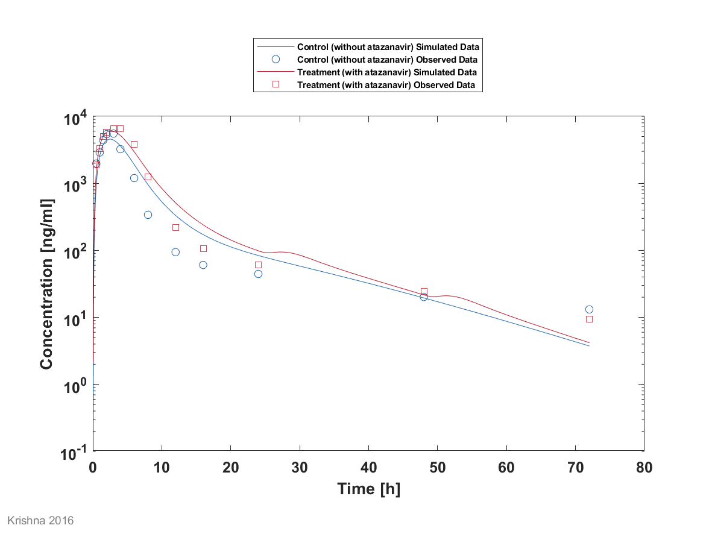
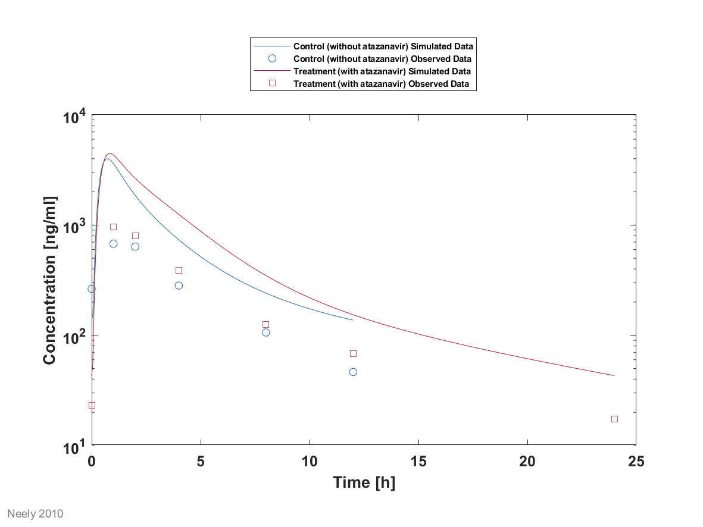
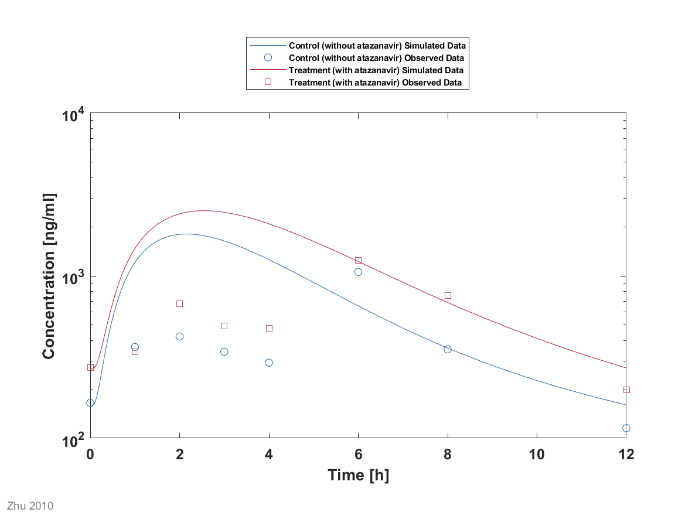
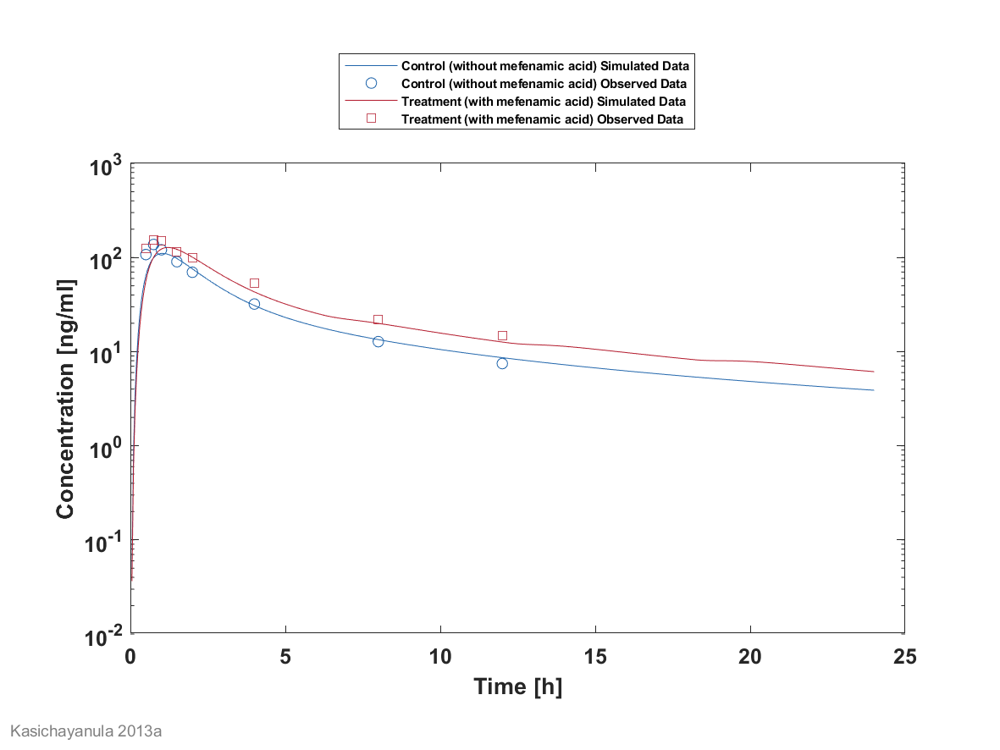

# UGT DDI Inhibition Qualification 

| Version                         | 1.0                                                          |
| ------------------------------- | ------------------------------------------------------------ |
| Repository                      | https://github.com/Open-Systems-Pharmacology/Qualification-DDI-UGT |
| Release                         | https://github.com/Open-Systems-Pharmacology/Qualification-DDI-UGT/releases/tag/v1.0 |
| OSP version                     | 8.0                                                          |
| Qualification framework version | 2.1                                                          |
| Author                          | Sebastian Frechen (sfrechen)                                 |

# Table of Contents
  * [1 Introduction](#1-introduction)
    * [1.1 Objective](#11-objective)
    * [1.2 UGT DDI Network](#12-ugt-ddi-network)
  * [2 Qualification of Use Case UGT-mediated DDI](#2-qualification-of-use-case-ugt-mediated-ddi)
  * [3 Concentration-Time Profiles](#3-concentration-time-profiles)
    * [3.1 Atazanavir - Raltegravir DDI](#31-atazanavir---raltegravir-ddi)
    * [3.2 Mefenamic acid - Dapagliflozin DDI](#32-mefenamic-acid---dapagliflozin-ddi)
  * [4 References](#4-references)
  * [5 Appendix](#5-appendix)
    * [5.1 Open Systems Pharmacology Suite (OSPS) Introduction](#51-open-systems-pharmacology-suite-osps-introduction)
    * [5.2 Mathematical Implementation of Drug-Drug Interactions](#52-mathematical-implementation-of-drug-drug-interactions)
    * [5.3 Automatic (re)-qualification workflow](#53-automatic-re-qualification-workflow)
# 1 Introduction

## 1.1 Objective
This qualification report evaluates the predictive performance of the open systems pharmacology (OSP) suite to predict UGT1A1- and UGT1A9-mediated drug-drug interactions.

The qualification report demonstrates the level of confidence of the OSP suite with regard to
reliable PBPK predictions of inhibition of UGT1A1 and UGT1A9 by selected perpetrators on sensitive substrates by means of pre-specified qualification measures. The presented PBPK models as well as the respective qualification plan and qualification report are transparently documented and provided open-source (https://github.com/Open-Systems-Pharmacology/Qualification-DDI-UGT).

Descriptions and evaluations of the included models are documented separately in the respective model repositories.

Please refer to the [Appendix](#5-Appendix) to learn more details:

- An overview over the Open Systems Pharmacology Suite is given in chapter [Section 5.1](#51-Open-Systems-Pharmacology-Suite-(OSPS)-Introduction)
- [Section 5.2](#52-Mathematical-Implementation-of-Drug-Drug-Interactions) shows the implementation of the underlying mathematical equations for drug-drug interactions in the OSP suite.
- A detailed general description of the performed qualification workflow can be found in chapter [Section 5.3](#53-Automatic-(re)-qualification-workflow).

  

## 1.2 UGT DDI Network
The following perpetrator compounds were selected:

- **Atazanavir** (UGT1A1 inhibitor), PBPK model v1.0 description and evaluation in
  https://github.com/Open-Systems-Pharmacology/Atazanavir-Model/releases/tag/v1.0 

- **Mefenamic acid** (UGT1A9 inhibitor), PBPK model v1.0 description and evaluation in
 https://github.com/Open-Systems-Pharmacology/Mefenamic-acid-Model/releases/tag/v1.0 

  

The following sensitive substrates as victim drugs were selected:

- **Raltegravir** (UGT1A1 substrate), PBPK model v1.0 description and evaluation in
  https://github.com/Open-Systems-Pharmacology/Raltegravir-Model/releases/tag/v1.0 
  
- **Dapagliflozin** (UGT1A9 substrate), PBPK model v1.0 description and evaluation in
  https://github.com/Open-Systems-Pharmacology/Dapagliflozin-Model/releases/tag/v1.0 
  
  ​	

Corresponding DDI modelling files can be found in:

- **Atazanavir-Raltegravir-DDI** (v1.0):
  https://github.com/Open-Systems-Pharmacology/Atazanavir-Raltegravir-DDI/releases/tag/v1.0
- **Mefenamic acid-Dapagliflozin-DDI** (v1.0):
  https://github.com/Open-Systems-Pharmacology/Mefenamic_acid-Dapagliflozin-DDI/releases/tag/v1.0

The following clinical studies are part of this qualification report:

| Enzyme | Perpetrator / victim           | Study design                                                 | Clinical study                      |
| ------ | ------------------------------ | ------------------------------------------------------------ | ----------------------------------- |
| UGT1A1 | Atazanavir / raltegravir       | Raltegravir: 100 mg single dose on day 7 simultaneous with the 7th dose of atazanavir Atazanavir: 400 mg once daily dosing | [Iwamoto 2008](#4-References)       |
| UGT1A1 | Atazanavir / raltegravir       | Raltegravir: 1200 mg single dose on day 7 simultaneous with the 7th dose of atazanavir Atazanavir: 400 mg once daily dosing | [Krishna 2008,](#4-References)      |
| UGT1A1 | Atazanavir / raltegravir       | Raltegravir: 400 mg once daily dosing (control phase 400 mg twice daily) Atazanavir: 400 mg once daily dosing DDI assessment on day 8 | [Neely 2010](#4-References)         |
| UGT1A1 | Atazanavir / raltegravir       | Raltegravir: 400 mg twice daily dosing  Atazanavir: 300 mg twice daily dosing DDI assessment on day 27 | [Zhu 2010](#4-References)           |
| UGT1A9 | Mefenamic acid / dapagliflozin | Dapagliflozin: 10 mg single dose on day 2 simultaneous with the 5th dose of mefenamic acid (24 hours after the first mefenamic acid dose) Mefenamic acid: 500 mg loading dose, followed by 8 doses of 250 mg mefenamic acid every 6 hours | [Kasichayanula 2013](#4-References) |

# 2 Qualification of Use Case UGT-mediated DDI

GMFE = 1.131745 

GMFE = 1.102437 

|AUC                       |Number|Ratio [%]|
|-------------------------:|-----:|--------:|
|Points total              |5     |-        |
|Points within Guest et al.|5     |100      |
|Points within 2-fold      |5     |100      |

|CMAX                      |Number|Ratio [%]|
|-------------------------:|-----:|--------:|
|Points total              |5     |-        |
|Points within Guest et al.|4     |80       |
|Points within 2-fold      |5     |100      |

|Perpetrator                     |Victim           |Predicted AUC Ratio|Observed AUC Ratio|Pred/Obs AUC Ratio|Predicted CMAX Ratio|Observed CMAX Ratio|Pred/Obs CMAX Ratio|Reference          |
|-------------------------------:|----------------:|------------------:|-----------------:|-----------------:|-------------------:|------------------:|------------------:|------------------:|
|Atazanavir, 400 mg, PO          |Raltegravir, PO  |1.4925             |1.72              |0.86775           |1.3576              |1.53               |0.8873             |Iwamoto 2008       |
|Atazanavir, 400 mg, PO          |Raltegravir, PO  |1.426              |1.67              |0.85387           |1.3323              |1.16               |1.1485             |Krishna 2016       |
|Atazanavir, 400 mg, PO          |Raltegravir, PO  |1.444              |1.72              |0.83952           |1.1171              |1.37               |0.81541            |Neely 2010         |
|Atazanavir, 400 mg, PO          |Raltegravir, PO  |1.5716             |1.536             |1.0232            |1.3904              |1.394              |0.99739            |Zhu 2010           |
|Mefenamic Acid, 500 / 250 mg, PO|Dapagliflozin, PO|1.3378             |1.51              |0.88594           |1.1561              |1.13               |1.0231             |Kasichayanula 2013a|

# 3 Concentration-Time Profiles
The published DDI study between the respective perpetrator and victim drug was simulated and compared to observed data.

[Section 3.1](#31-Atazanavir---Raltegravir-DDI) shows concentration time profiles of the four clinical studies between atazanavir and raltegravir ([Iwamoto 2008](#4-References), [Krishna 2008](#4-References), [Neely 2010](#4-References), [Zhu 2010](#4-References)).

[Section 3.2](#32-Mefenamic-acid---Dapagliflozin-DDI) shows concentration time profiles of the clinical study between mefenamic acid and dapagliflozin ([Kasichayanula 2013](#4-References)).

## 3.1 Atazanavir - Raltegravir DDI
The atazanavir / raltegravir interaction was evaluated using four clinical DDI studies ([Iwamoto 2008](#5-References), [Krishna 2008](#5-References), [Neely 2010](#5-References), [Zhu 2010](#5-References)).

The respective model repository can be found in:
https://github.com/Open-Systems-Pharmacology/Atazanavir-Raltegravir-DDI

## 3.2 Mefenamic acid - Dapagliflozin DDI
The mefenamic acid / dapagliflozin interaction was evaluated using 1 clinical DDI study ([Kasichayanula 2013](#5-References)).

The respective model repository can be found in:
https://github.com/Open-Systems-Pharmacology/Mefenamic_acid-Dapagliflozin-DDI

# 4 References
**Guest 2011** Guest EJ, Aarons L, Houston JB, Rostami-Hodjegan A, Galetin A. Critique of the twofold measure of prediction success for ratios: application for the assessment of drug-drug
interactions. Drug metabolism and disposition: the biological fate of chemicals. 2011;39(2):170-3

**Iwamoto 2008** Iwamoto M, Wenning LA, Mistry GC, Petry AS, Liou SY, Ghosh K, et al. Atazanavir modestly increases plasma levels of raltegravir in healthy subjects. Clinical infectious diseases :
an official publication of the Infectious Diseases Society of America. 2008;47(1):137-40.

**Kasichayanula 2013** Kasichayanula S, Liu X, Griffen SC, Lacreta FP, Boulton DW. Effects of
rifampin and mefenamic acid on the pharmacokinetics and pharmacodynamics of dapagliflozin.
Diabetes, obesity & metabolism. 2013;15(3):280-3. 	

**Krishna 2008** Krishna R, East L, Larson P, Valiathan C, Deschamps K, Luk JA, et al. Atazanavir
increases the plasma concentrations of 1200 mg raltegravir dose. Biopharmaceutics & drug
disposition. 2016;37(9):533-41.

**Neely 2010** Neely M, Decosterd L, Fayet A, Lee JS, Margol A, Kanani M, et al. Pharmacokinetics and pharmacogenomics of once-daily raltegravir and atazanavir in healthy volunteers.
Antimicrobial agents and chemotherapy. 2010;54(11):4619-25.

**Zhu 2010** Zhu L, Butterton J, Persson A, Stonier M, Comisar W, Panebianco D, et al.
Pharmacokinetics and safety of twice-daily atazanavir 300 mg and raltegravir 400 mg in healthy
individuals. Antiviral therapy. 2010;15(8):1107-14.

# 5 Appendix

## 5.1 Open Systems Pharmacology Suite (OSPS) Introduction
Open Systems Pharmacology Suite (OSP suite) is a tool for PBPK modeling and simulation of drugs in laboratory animals and humans. PK-Sim® and MoBi® are part of the OSP suite [[1](#References-for-OSPS-introduction)].  PK-Sim® is based on a generic PBPK-model with 18 organs and tissues. One of the main assumptions is that all compartments are well-stirred. Represented organs/tissues include arterial and venous blood, adipose tissue (separable adipose, excluding yellow marrow), brain, lung, bone (including yellow marrow), gonads, heart, kidneys, large intestine, liver, muscle, portal vein, pancreas, skin, small intestine, spleen and stomach, as shown in **Figure 1**.

Each organ consists of four sub-compartments namely the plasma, blood cells (which together build the vascular space), interstitial space, and cellular space. Distribution between the plasma and blood cells as well as between the interstitial and cellular compartments can be permeability-limited. In the brain, the permeation barrier is located between the vascular and the interstitial space. PK-Sim® estimates model parameters (intestinal permeability [[2](##References-for-OSPS-introduction)] organ partition coefficients (tissue-to-plasma partition coefficients) [[3,4](#References-for-OSPS-introduction)], and permeabilities) from physico-chemical properties of compounds (molecular weight, pKa, acid/base properties) and the composition of each tissue compartment (lipids, water and proteins). Partition coefficients can be calculated using a variety of methods available in PK-Sim®, for example the internal PK-Sim® method [[3,4](#References-for-OSPS-introduction)] or that of Rodgers and Rowland [[5-7](##References-for-OSPS-introduction)]. 

Physiological databases included in the software incorporate the dependencies of organ composition, organ weights, organ blood flows and gastrointestinal parameters (gastrointestinal length, radius of each section, intestinal surface area, gastrointestinal transit times, and pH in different intestinal segments [[2](#References-for-OSPS-introduction)]), with the user-defined body weight and height and ethnicity of the individual [[8](#References-for-OSPS-introduction)]. Thereby, PK Sim® allows generating realistic virtual populations. For a detailed description of the PBPK model structure implemented in PK Sim®, see Willmann et al. [[2,4,8,9](#References-for-OSPS-introduction)] or the OSP Suite homepage (<https://docs.open-systems-pharmacology.org/mechanistic-modeling-of-pharmacokinetics-and-dynamics/modeling-concepts>).

**Figure** **1: Structure of the Whole Body PBPK Model integrated in PK-Sim®**

## References for OSPS introduction

[1] [www.open-systems-pharmacology.org](http://www.open-systems-pharmacology.org/)

[2] [Willmann S, Schmitt W, Keldenich J, Lippert J, Dressman JB. A physiological model for the estimation of the fraction dose absorbed in humans.J Med Chem. 2004 Jul 29;47(16):4022-31.](https://www.ncbi.nlm.nih.gov/pubmed/15267240)

[3] [Haerter MW, K.J., Schmitt W, *Estimation of physicochemical and ADME parameters.* , in *Handbook of Combinatorial Chemistry: Drugs, Catalysts, Materials*, H.W. Nicolaou KC HR, Editor. 2002, Wiley VCH Verlag GmbH: Weinheim, Germany. p. 743-60.](https://onlinelibrary.wiley.com/doi/pdf/10.1002/3527603034.ch26)

[4] [Willmann S, Lippert J, Schmitt W. From physicochemistry to absorption and distribution: predictive mechanistic modelling and computational tools. Expert Opin Drug Metab Toxicol. 2005 Jun;1(1):159-68.](https://www.ncbi.nlm.nih.gov/pubmed/16922658)

[5] [Rodgers, T, D. Leahy, and M. Rowland. Physiologically based pharmacokinetic modeling 1: predicting the tissue distribution of moderate-to-strong bases. J Pharm Sci. 2005 Jun;94(6):1259-76.](https://www.ncbi.nlm.nih.gov/pubmed/15858854)

[6] [Rodgers T, Rowland M. Physiologically based pharmacokinetic modelling 2: predicting the tissue distribution of acids, very weak bases, neutrals and zwitterions. J Pharm Sci. 2006 Jun;95(6):1238-57.](https://www.ncbi.nlm.nih.gov/pubmed/16639716)

[7] [Rodgers T, Rowland M. Mechanistic approaches to volume of distribution predictions: understanding the processes. Pharm Res. 2007 May;24(5):918-33.](https://www.ncbi.nlm.nih.gov/pubmed/17372687)

[8] [Willmann S, Höhn K, Edginton A, Sevestre M, Solodenko J, Weiss W, Lippert J, Schmitt W. Development of a physiology-based whole-body population model for assessing the influence of individual variability on the pharmacokinetics of drugs. J Pharmacokinet Pharmacodyn. 2007 Jun;34(3):401-31.](https://www.ncbi.nlm.nih.gov/pubmed/17431751)

[9] [Willmann S, Lippert J, Sevestre M, Solodenko J, Fois F, Schmitt W. PK-Sim®: a physiologically based pharmacokinetic ‘whole-body’ model. Biosilico 2003.1(4):121-24.](https://www.sciencedirect.com/science/article/pii/S1478538203023424?via%3Dihub)

## 5.2 Mathematical Implementation of Drug-Drug Interactions

**DDI modeling: Competitive inhibition** 

A detailed representation of the mathematical implementation of competitive enzyme inhibition  can be found in the OSP manual [here](https://docs.open-systems-pharmacology.org/working-with-pk-sim/pk-sim-documentation/pk-sim-compounds-defining-inhibition-induction-processes#competitive-inhibition-simple-setting-with-one-inhibitor).

**DDI modeling: Mechanism-based inhibition**

A detailed representation of the mathematical implementation of mechanism-based enzyme inhibition  can be found in the OSP manual [here](https://docs.open-systems-pharmacology.org/working-with-pk-sim/pk-sim-documentation/pk-sim-compounds-defining-inhibition-induction-processes#irreversible-inhibition).

**DDI modeling: Induction**

A detailed representation of the mathematical implementation of enzyme induction can be found in the OSP manual [here](https://docs.open-systems-pharmacology.org/working-with-pk-sim/pk-sim-documentation/pk-sim-compounds-defining-inhibition-induction-processes#enzyme-induction).

## 5.3 Automatic (re)-qualification workflow
[Open Systems Pharmacology](http://www.open-systems-pharmacology.org) provides a dynamic landscape of model repositories and a database of observed clinical data. Additionally, a technical framework to assess confidence of a specific intended use has been developed (qualification runner and reporting engine). This framework allows for an automatic (re)-qualification workflow of the OSP suite, comprising the following steps (**Figure 1**):

- PBPK model development and verification with observed data,

- Qualification plan generation,

- Qualification plan execution,

- Qualification report generation.

  

**Figure 1: OSP suite automatic (re)-qualification workflow**

In a first step, the respective qualification scenario is saved in a special qualification repository on [GitHub](https://github.com/Open-Systems-Pharmacology/). This qualification scenario repository contains a detailed qualification plan that links and combines respective models and data to address the use case that shall be qualified. Therefore, the qualification plan consists of: 

- PK-Sim project files,
- Additional model building steps (if applicable),
- Description of potential cross-dependencies between PK-Sim project files (if applicable),
- Observed data (needed for model development and verification),
- Qualification scenario description text modules
- Detailed report settings to describe the generation of charts and qualification measures. 

PK-Sim projects, observed data sets, and qualification scenario text modules are deposited in distinct repositories and are referenced by the qualification plan (**Figure 2**).

**Figure 2: Qualification scenario repository landscape on GitHub**

In a second step the [qualification runner](https://github.com/Open-Systems-Pharmacology/QualificationRunner) processes the qualification plan, i.e. all project parts are exported and prepared for the [reporting engine](https://github.com/Open-Systems-Pharmacology/Reporting-Engine). The reporting engine provides a validated environment (currently implemented in MATLAB®, a transfer to R is in development) for model execution and finally generates the qualification report. This report contains the evaluation of the individual PBPK models with observed data (i.e. standard goodness of fit plots, visual predictive checks) and a comprehensive qualification of the specific use case assessing the predictive performance of the OSP suite by means of a predefined set of qualification measures and charts. 

The automated execution of the described workflow can be triggered to assess re-qualification in case new data, changes in model structure or parameterization, or new OSP suite releases arise.

